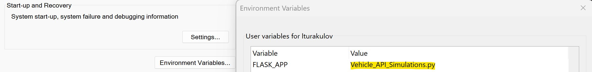
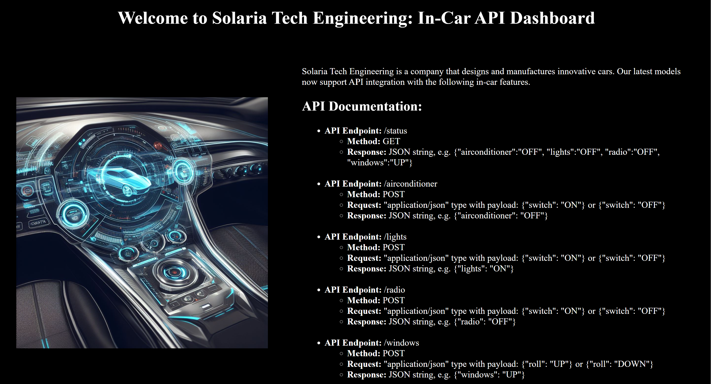
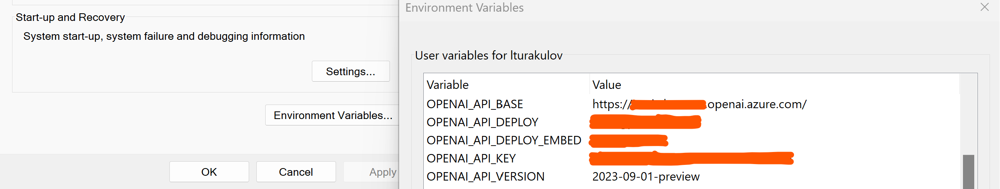

# Parallel functon calling in Azure OpenAI GPT-4-Turbo, with a companion Web API app.

Version 1106 of Azure OpenAI GPT models, such as GPT-35-Turbo and GPT-4-Turbo, now supports the use of parallel function calling. This new feature allows your Azure OpenAI based solution to extract multiple intents from a single prompt, check the functions available and then execute them in parallel. As a result, your solution will perform more effectively and efficiently because of a shorter round-trips between required multiple API calls.

In this repo I'll demo the use of the latest openai Python package v1.x, that was released in November 2023. To use the latest version of *openai* python package, please upgrade it with the following pip command:
```
pip install --upgrade openai
```

Additionally, to help with the practical test of API calls, I provide a companion Web app in Flask to expose in-car API endpoints of a fictitious automotive company. Detailed instructions on the Web app activation and the use of provided Jupyter notebooks are provided below.

## Table of contents:
- [Step 1: Configuring Flask Web app](https://github.com/LazaUK/AOAI-ParallelFunctionCalling-SDKv1#step-1-configuring-flask-web-app)
- [Step 2: Configuring Azure OpenAI environment](https://github.com/LazaUK/AOAI-ParallelFunctionCalling-SDKv1#step-2-configuring-azure-openai-environment)
- [Step 3: End-to-end testing of parallel function calling](https://github.com/LazaUK/AOAI-ParallelFunctionCalling-SDKv1#step-3-end-to-end-testing-of-parallel-function-calling)

## Step 1: Configuring Flask Web app
1. Add new environment variable named **FLASK_APP** that points to the provided *Vehicle_API_Simulations.py* Python script.

2. Start Flask Web app from the repo's root folder:
```
python -m flask run
```
3. You should be able to access its home page at http://localhost:5000/

4. As described on the home page, this Web app exposes the following 5 API endpoints of a fictitious vehicle's in-car controls:
   - GET endpoint at http://localhost:5000/status to get the latest **status** of each vehicle control;
   - POST endpoint at http://localhost:5000/airconditioner to switch the **air conditioner** on / off;
   - POST endpoint at http://localhost:5000/lights to switch the **lights** on / off;
   - POST endpoint at http://localhost:5000/radio to switch the **radio** on / off;
   - POST endpoint at http://localhost:5000/windows to roll the **windows** up / down.

5. The Status endpoint returns key/value pairs for all 4 controls in JSON format.
``` JSON
{'airconditioner': 'OFF', 'lights': 'OFF', 'radio': 'OFF', 'windows': 'DOWN'}
```
6. The POST endpoints expect you to add **Content-Type** header, set to **application/json**.
``` JSON
{"Content-Type": "application/json"}
```
8. Air Conditioner, Lights and Radio endpoints require a body payload, which accepts **ON** and **OFF** values for its *switch* key.
``` JSON
{
    "switch": "ON"
}
```
9. Windows endpoint also requires a body payload, although it accepts **UP** and **DOWN** values for its *roll* key. 
``` JSON
{
    "roll": "DOWN"
}
```

## Step 2: Configuring Azure OpenAI environment
1. Assign Azure OpenAI API endpoint name, version and key, along with the Azure OpenAI deployment name of GPT-4-Turbo model to **OPENAI_API_BASE**, **OPENAI_API_VERSION**, **OPENAI_API_KEY** and **OPENAI_API_DEPLOY** environment variables.

2. AzureOpenAI client will be instantiated with retrieved environment variables.
``` Python
client = AzureOpenAI(
    azure_endpoint = os.getenv("OPENAI_API_BASE"),
    api_key = os.getenv("OPENAI_API_KEY"),
    api_version = os.getenv("OPENAI_API_VERSION")
)
```
3. GPT-4-Turbo model will be called twice:
   - to analyse the original prompt and decide which functions to call.
``` Python
response = client.chat.completions.create(
    model = os.getenv("OPENAI_API_DEPLOY"), # model = "Azure OpenAI deployment name".
    messages = messages,
    tools = tools,
    tool_choice = "auto",  # auto is default, but we'll be explicit
)
```
   - and then again later to process data retrieved from API endpoints and send its completion back to the client.
``` Python
second_response = client.chat.completions.create(
    model = os.getenv("OPENAI_API_DEPLOY"), # model = "Azure OpenAI deployment name".
    messages=messages
)
```

## Step 3: End-to-end testing of parallel function calling
